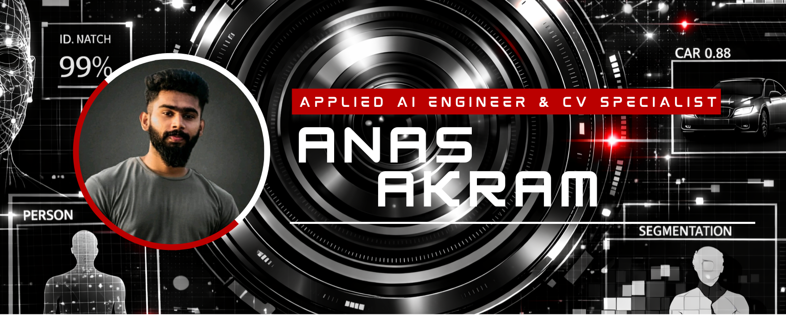

<!DOCTYPE html>
<html lang="en">
<head>
    <meta charset="UTF-8">
    <meta name="viewport" content="width=device-width, initial-scale=1.0">
    <title>Anas Akram - Applied AI Engineer</title>
    <link href="https://fonts.googleapis.com/css2?family=Orbitron:wght@400;500;600;700;800;900&family=Rajdhani:wght@300;400;500;600;700&family=Share+Tech+Mono&display=swap" rel="stylesheet">
    
</head>
<body data-theme="dark">
    

    

    
    <button class="theme-toggle" onclick="toggleTheme()">
        LIGHT MODE
    </button>

    

        

            

                
            

            

                
            

            

                

                    <pre>ROLE: Applied AI Engineer
FOCUS: Computer Vision
EXPERIENCE: 3+ Years
LOCATION: Colombo, Sri Lanka</pre>
                

                

                    <pre>SPECIALIZATION: Face Recognition
SCALE: 250,000+ Identities
LATENCY: <50ms Real-Time
ACCURACY: 99.7% Recognition</pre>
                

                

                    <pre>DEPLOYMENT: Production-Grade
GPU: TensorRT Optimized
EDGE: Jetson Orin NX
UPTIME: 99.9% Availability</pre>
                

                

                    <pre>API: 100+ Requests/Sec
DATABASES: PostgreSQL, Redis
FRAMEWORK: Flask, FastAPI
MODE: 24/7 Operations</pre>
                

            

            

                
                
                
                
            

            

                
            

        

        <h2 class="section-title">TECHNICAL STACK</h2>

        

            <h3 class="subsection-title">ARTIFICIAL INTELLIGENCE & DEEP LEARNING</h3>
            

                

                    
                     PyTorch
                

                

                    
                     TensorFlow
                

                

                    
                     OpenCV
                

                

                    
                     Ultralytics
                

                

                    
                     NumPy
                

                

                    
                     Pandas
                

                

                    
                     Scikit-learn
                

            

            
<strong>Advanced:</strong> TensorRT • ONNX • YOLO (v5/v8/v11) • InsightFace • Stable Diffusion • Hugging Face Transformers

        

        

            <h3 class="subsection-title">HARDWARE & EDGE AI PLATFORMS</h3>
            

                

                    
                     Jetson Orin
                

                

                    
                     Raspberry Pi
                

                

                    
                     CUDA
                

                

                    
                     TensorRT
                

            

            
<strong>Platforms:</strong> NVIDIA Jetson Orin NX • Raspberry Pi 5 • CUDA Servers • L4T/JetPack • Multi-GPU Infrastructure

        

        

            <h3 class="subsection-title">BACKEND & API DEVELOPMENT</h3>
            

                

                    
                     FastAPI
                

                

                    
                     Flask
                

                

                    
                     Redis
                

                

                    
                     PostgreSQL
                

                

                    
                     MySQL
                

                

                    
                     ClickHouse
                

                

                    
                     WebSocket
                

            

            
<strong>Architecture:</strong> RESTful APIs • WebSocket Real-Time • Redis Pub/Sub • Database Optimization • Distributed Systems

        

        

            <h3 class="subsection-title">FRONTEND & WEB DEVELOPMENT</h3>
            

                

                    
                     React
                

                

                    
                     TypeScript
                

                

                    
                     JavaScript
                

                

                    
                     HTML5
                

                

                    
                     CSS3
                

                

                    
                     Bootstrap
                

                

                    
                     Tailwind
                

            

        

        

            <h3 class="subsection-title">DEVOPS & INFRASTRUCTURE</h3>
            

                

                    
                     Docker
                

                

                    
                     Linux
                

                

                    
                     Ubuntu
                

                

                    
                     Bash
                

                

                    
                     Git
                

                

                    
                     GitHub
                

                

                    
                     VSCode
                

            

        

        

            <h3 class="subsection-title">AI AUTOMATION & INTEGRATION</h3>
            

                

                    
                     n8n
                

                

                    
                     OpenAI API
                

                

                    
                     Hugging Face
                

                

                    
                     Twilio
                

            

            
<strong>Tools:</strong> Deepgram (STT) • ElevenLabs (TTS) • LangChain • Vector Databases

        

        

            <h3 class="subsection-title">PROGRAMMING LANGUAGES</h3>
            

                

                    
                     Python
                

                

                    
                     TypeScript
                

                

                    
                     JavaScript
                

                

                    
                     C++
                

                

                    
                     SQL
                

                

                    
                     Bash
                

            

        

        

            
        

        <h2 class="section-title">FEATURED PROJECTS</h2>

        

            

                <h3 class="project-title">Enterprise Face Recognition System</h3>
                
Large-Scale Biometric Authentication

                
                

                    <pre>Scale: 250,000+ Identities
Latency: <50ms Real-Time
Recognition: 99.7% Accuracy
Performance: 30+ FPS Live
Infrastructure: Multi-GPU Production</pre>
                

                

                    <h4>Core Technologies</h4>
                    <ul>
                        <li>InsightFace Recognition Engine</li>
                        <li>Redis In-Memory Caching</li>
                        <li>PostgreSQL Database</li>
                        <li>FastAPI Production APIs</li>
                        <li>TensorRT GPU Optimization</li>
                        <li>Multi-GPU Distribution</li>
                    </ul>
                

                

                    <h4>System Architecture</h4>
                    <ul>
                        <li>Sub-50ms end-to-end latency</li>
                        <li>Distributed GPU infrastructure</li>
                        <li>Real-time face detection</li>
                        <li>Advanced anti-spoofing</li>
                        <li>99.9% system uptime</li>
                    </ul>
                

            

            

                <h3 class="project-title">Casino Vision Analytics System</h3>
                
Multi-Table Computer Vision Monitoring

                
                

                    <pre>Deployment: Jetson Orin NX
Tables: 8+ Concurrent
FPS: 30+ Real-Time
Detection: YOLO v8/v11
Optimization: TensorRT 5x Speedup</pre>
                

                

                    <h4>Technical Stack</h4>
                    <ul>
                        <li>YOLO Object Detection</li>
                        <li>TensorRT Model Optimization</li>
                        <li>NVIDIA Jetson Orin NX</li>
                        <li>Multi-Stream Processing</li>
                        <li>Real-Time Analytics</li>
                        <li>Edge AI Deployment</li>
                    </ul>
                

                

                    <h4>Key Features</h4>
                    <ul>
                        <li>8+ concurrent table monitoring</li>
                        <li>Real-time chip detection</li>
                        <li>Card recognition accuracy</li>
                        <li>Player tracking system</li>
                        <li>30+ FPS performance</li>
                    </ul>
                

            

            

                <h3 class="project-title">Production YOLO Inference API</h3>
                
High-Performance Object Detection Service

                
                

                    <pre>Model: YOLO v8 Custom
Throughput: 100+ Requests/Sec
Latency: <50ms Average
GPU: TensorRT Optimized
Deployment: 24/7 Production</pre>
                

                

                    <h4>Implementation</h4>
                    <ul>
                        <li>Custom YOLO Training Pipeline</li>
                        <li>TensorRT GPU Acceleration</li>
                        <li>FastAPI Framework</li>
                        <li>Redis Request Caching</li>
                        <li>Auto-scaling Infrastructure</li>
                        <li>Prometheus Monitoring</li>
                    </ul>
                

                

                    <h4>Production Features</h4>
                    <ul>
                        <li>High-throughput API serving</li>
                        <li>Batch processing support</li>
                        <li>Real-time model updates</li>
                        <li>Comprehensive logging</li>
                        <li>99.9% uptime guarantee</li>
                    </ul>
                

            

            

                <h3 class="project-title">Stable Diffusion Fine-Tuning</h3>
                
Custom Generative AI Models

                
                

                    <pre>Framework: Diffusers Library
Models: SD 1.5 / SDXL
Training: LoRA Fine-Tuning
Techniques: DreamBooth, ControlNet
Inference: 8-bit Quantization</pre>
                

                

                    <h4>Technical Implementation</h4>
                    <ul>
                        <li>Hugging Face Transformers</li>
                        <li>PyTorch Training Pipeline</li>
                        <li>Dataset Preparation</li>
                        <li>Model Quantization (8-bit)</li>
                        <li>FastAPI Deployment</li>
                        <li>Redis Caching</li>
                    </ul>
                

                

                    <h4>Production Features</h4>
                    <ul>
                        <li>Domain-specific tuning</li>
                        <li>Cloud API deployment</li>
                        <li>REST integration</li>
                        <li>Performance monitoring</li>
                    </ul>
                

            

            

                <h3 class="project-title">Facebook Message Automation</h3>
                
n8n + OpenAI Integration

                
                

                    <pre>Platform: n8n Automation
AI: OpenAI GPT-4 API
Server: Custom Ubuntu
Uptime: 24/7 Operation
Efficiency: 90% Reduction</pre>
                

                

                    <h4>Technical Implementation</h4>
                    <ul>
                        <li>n8n Workflow Engine</li>
                        <li>OpenAI GPT-4 API</li>
                        <li>Facebook Graph API</li>
                        <li>Custom Ubuntu Server</li>
                        <li>Redis Message Queue</li>
                        <li>MySQL Database</li>
                    </ul>
                

                

                    <h4>System Performance</h4>
                    <ul>
                        <li>24/7 autonomous operation</li>
                        <li><2s response time</li>
                        <li>90% manual work reduction</li>
                        <li>99.8% uptime</li>
                    </ul>
                

            

        

        

            
        

        <h2 class="section-title">PERFORMANCE METRICS</h2>

        

            

                
FACE RECOGNITION

                <pre>Identities: 250,000+
Latency: <50ms
Accuracy: 99.7%
FPS: 30+
Uptime: 99.9%</pre>
            

            

                
API PERFORMANCE

                <pre>Requests/Sec: 100+
Avg Response: 45ms
Concurrent: 200+
WebSocket: Real-Time
Availability: 24/7</pre>
            

            

                
EDGE DEPLOYMENT

                <pre>Platform: Jetson Orin
GPU: TensorRT
Speedup: 5x
Power: 15W-60W
Latency: <30ms</pre>
            

            

                
VISION SYSTEMS

                <pre>Tables: 8+ Concurrent
FPS: 30+
Accuracy: 98.5%
Detection: YOLO
Mode: Real-Time</pre>
            

        

        

            
        

        <h2 class="section-title">EDUCATION</h2>

        

            
<strong>BSc (Hons) Computer Science with Artificial Intelligence</strong>

            
Coventry University, United Kingdom | Completed 2025

            
<strong>First-Class Honours (80%)</strong>

             
            
Key Modules: Machine Learning (83%) • Artificial Neural Networks (75.5%) • Intelligent Agents (79%)

        

        

            
        

        <h2 class="section-title">TECHNICAL FOCUS AREAS</h2>

        

            

                <h3 class="project-title">PRIMARY RESEARCH</h3>
                

                    <pre>focus_areas = {
    "Computer Vision": [
        "Large-Scale Face Recognition",
        "Real-Time Object Detection",
        "Instance Segmentation",
        "Video Analytics",
        "Multi-Camera Fusion"
    ],
    
    "Edge AI": [
        "NVIDIA Jetson Optimization",
        "Model Quantization",
        "Hardware-Accelerated Inference",
        "Power-Efficient AI",
        "Embedded Vision Systems"
    ],
    
    "AI Optimization": [
        "TensorRT GPU Acceleration",
        "ONNX Model Conversion",
        "Multi-GPU Distribution",
        "CUDA Kernel Optimization",
        "Low-Latency Inference"
    ]
}</pre>
                

            

            

                <h3 class="project-title">EMERGING TECHNOLOGIES</h3>
                

                    <pre>exploring = {
    "Generative AI": [
        "Stable Diffusion Fine-Tuning",
        "ControlNet & IP-Adapter",
        "Text-to-Image Generation",
        "Face-Guided Synthesis",
        "Custom Model Training"
    ],
    
    "LLM Integration": [
        "GPT-4 API Integration",
        "Custom LLM Fine-Tuning",
        "RAG Architectures",
        "Voice AI (STT/TTS)",
        "Conversational Systems"
    ],
    
    "Production AI": [
        "System Architecture",
        "High-Throughput APIs",
        "Distributed Computing",
        "MLOps & Deployment",
        "Performance Optimization"
    ]
}</pre>
                

            

        

        

            <h3 class="subsection-title">TECHNICAL PHILOSOPHY</h3>
            

                

                    
PERFORMANCE

                    
Low-latency inference

                    
High-throughput APIs

                    
GPU acceleration

                    
Edge optimization

                

                

                    
SCALABILITY

                    
Distributed computing

                    
Microservices design

                    
Database optimization

                    
System resilience

                

                

                    
PRODUCTION

                    
Operational reliability

                    
System monitoring

                    
Continuous improvement

                    
24/7 availability

                

            

        

        

            
        

        <h2 class="section-title">PROFESSIONAL OPPORTUNITIES</h2>

        

            

                <pre>Open For:
  - Full-Time Positions: Senior AI Engineer / Computer Vision Engineer
  - Consulting Projects: AI System Architecture & Implementation
  - Research Collaboration: Computer Vision & Edge AI
  - Technical Leadership: AI Engineering & Production Deployment

Expertise:
  - Computer Vision Systems (Face Recognition, Object Detection)
  - Edge AI Deployment (NVIDIA Jetson, TensorRT Optimization)
  - Production AI Architecture (High-Performance APIs, Distributed Systems)
  - AI Automation & Integration (LLM Deployment, Voice AI)

Location:
  - Remote (Global)
  - On-Site (Colombo, Sri Lanka)
  - Hybrid Opportunities</pre>
            

        

        

            
        

        <h2 class="section-title">CONTACT</h2>

        

            
            
            
            
        

        

            <blockquote>Architecting production-grade AI systems that operate at scale with millisecond precision</blockquote>
            
— Anas Akram, Applied AI Engineer

        

        

            
        

        

            
        

    

    
</body>
</html>